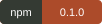
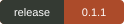
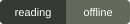
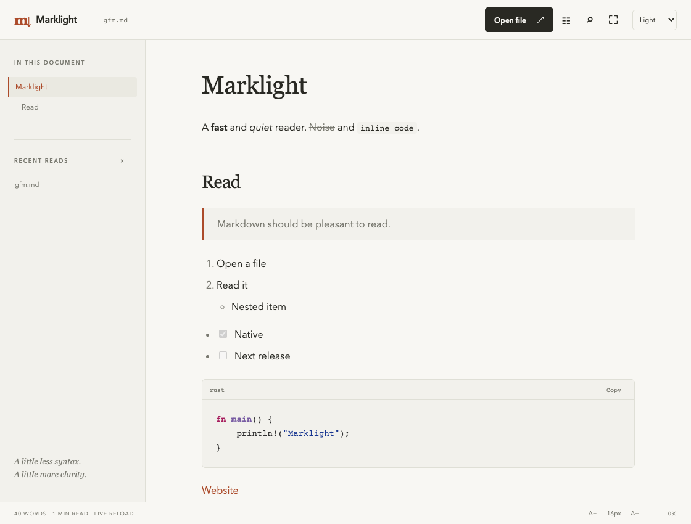

# Marklight

**Markdown is easy to write. Marklight makes it pleasant to read.**

Open a README, technical guide or note in your terminal—or settle into a
dedicated desktop window with readable type, an outline and code you can copy.
Built in Rust with Tauri 2. Your documents stay local. No accounts or telemetry.

[](https://www.npmjs.com/package/marklight)
[](https://github.com/OthmaneBlial/marklight/releases/latest)
[](LICENSE)
[](SECURITY.md)

[Website](https://othmaneblial.github.io/marklight/) ·
[Usage guide](https://othmaneblial.github.io/marklight/docs.html) ·
[Downloads](https://github.com/OthmaneBlial/marklight/releases/latest) ·
[npm](https://www.npmjs.com/package/marklight)



## A file is all you need

| In your terminal | In a dedicated window |
|---|---|
| `marklight README.md` | `marklight open README.md` |
| Styled headings, lists, tables and code | Comfortable typography and light/dark/system themes |
| Automatic wrapping and your familiar pager | Outline, highlighted search and zen mode |
| Stdin and plain output for Unix workflows | Normal text selection and exact code copying |

Both views use the same Rust Markdown engine. Save in your editor and the
desktop refreshes while keeping your place. Relative Markdown links let you
move through a local documentation folder.

## Start reading

On **macOS Apple Silicon (arm64)**, install the native terminal CLI from npm:

```sh
npm install --global marklight
marklight README.md
```

Or run `npx marklight README.md`. The npm package has no install hooks or
JavaScript runtime dependencies. It includes the CLI only.

With Rust stable, install from source:

```sh
cargo install --git https://github.com/OthmaneBlial/marklight marklight
```

Crates.io packages are not published yet; `cargo install marklight` is not the
installation command for this release. Linux, Windows and Intel Mac source
builds require validation on those platforms.

```sh
marklight .                              # README.md / README.markdown / index.md
git show HEAD:README.md | marklight -    # read stdin
marklight README.md --plain --no-pager   # plain output for scripts
marklight README.md --width 100          # explicit terminal width
marklight open README.md                 # launch the separately installed desktop
marklight README.md --gui                # same desktop bridge
```

Long terminal documents use `$PAGER`, defaulting to `less -R`. Search with `/`,
cycle with `n`/`N` and quit with `q`. Redirected output is plain and pager-free.

## Desktop reading

Download the **macOS Apple Silicon** app or DMG from
[Releases](https://github.com/OthmaneBlial/marklight/releases/latest). The initial
build is not Developer ID signed or notarized. Windows and Linux installers are
unverified. See [installation](docs/INSTALLATION.md) for source builds, checksums,
CLI discovery and choosing Marklight as your `.md`/`.markdown` viewer.

- Open files through the native menu, Cmd/Ctrl+O or drag and drop.
- Read with selectable text, exact original-code copying and syntax highlighting.
- Navigate a collapsible outline or search with Cmd/Ctrl+F.
- Choose system/light/dark, adjust type size, or enter zen with Cmd/Ctrl+Shift+Z.
- Keep your reading context when another editor saves the open file.
- Follow relative Markdown links and load local raster images from the document directory.

Marklight supports CommonMark and common GFM features: tables, task lists,
strikethrough, autolinks, fenced code and nested lists. Read the
[dialect limits](docs/MARKDOWN.md) and [security boundary](SECURITY.md). Documents
are bounded UTF-8 local files; remote images and executable HTML are blocked.
External links open through the system only after you click them.

## Performance and evidence

Measurements, hardware and reproduction commands are in
[performance](docs/PERFORMANCE.md). The desktop startup target of 500 ms has
**not been met** on the measured host. Large-file kernel measurements do not
include DOM layout, and synthetic repeated code benefits from the bounded cache.

[Validation](docs/VALIDATION.md) separates local Rust/browser checks, actual
native macOS checks, package publication and remaining platform limitations.
Browser screenshots above use real Rust rendering with a test IPC adapter;
native runtime verification is recorded separately.

## Develop locally

```sh
cargo fmt --check
cargo clippy --workspace --all-targets -- -D warnings
cargo test --workspace
npm --prefix apps/desktop ci
npm --prefix apps/desktop run build
cargo run -p marklight-render --example frontend_fixtures
npm --prefix apps/desktop test
```

Playwright requires a Chromium installation; `MARKLIGHT_CHROMIUM` can select an
existing compatible binary. `./scripts/check.sh` runs the local gates.
`./scripts/package.sh` builds native artifacts locally. No GitHub Actions
workflows are created or required.

[Architecture](docs/ARCHITECTURE.md) · [Contributing](CONTRIBUTING.md) ·
[Changelog](CHANGELOG.md) · [MIT license](LICENSE)

If Marklight improves your daily reading, **give the repository a star**.
Small, reproducible issues and thoughtful contributions help it get better.
